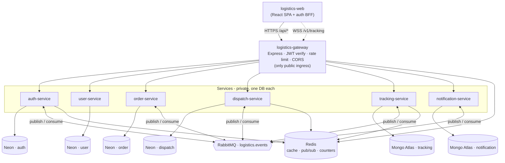
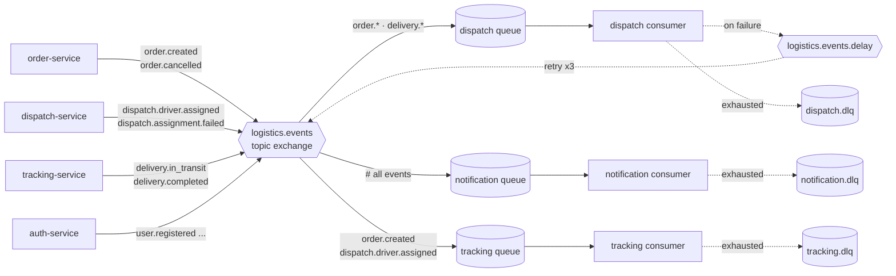
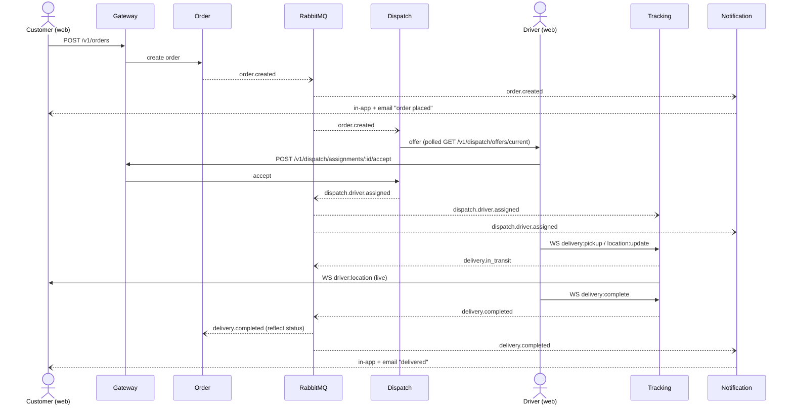
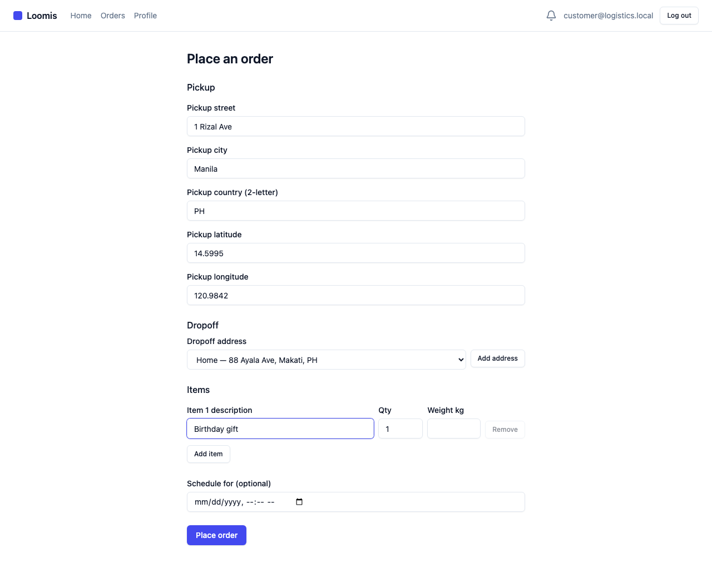
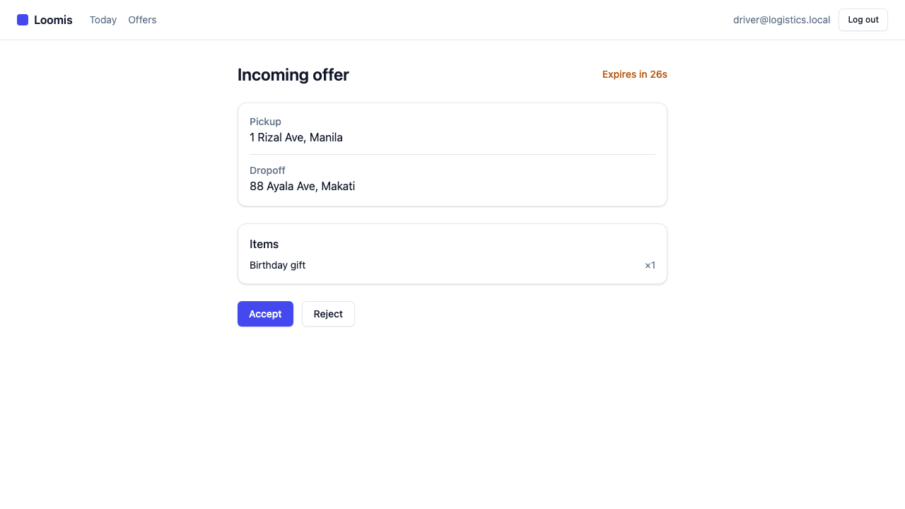
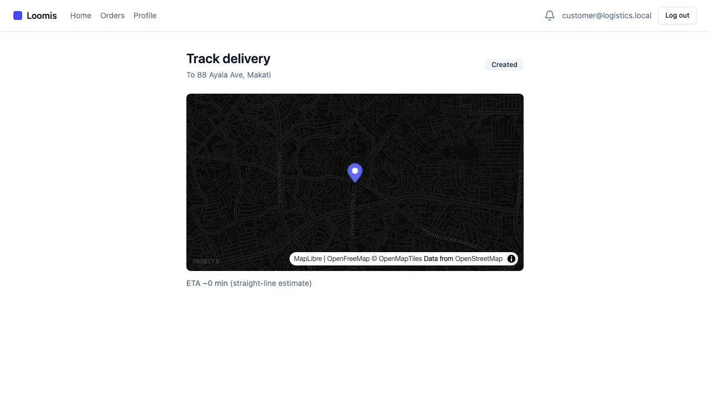

# AI Logistics & Delivery Management Platform

An event-driven, microservices logistics and delivery system built across 11 repos: a public gateway, 7 backend services (auth, user, order, dispatch, tracking, notification, and a stretch AI service), and a three-role React SPA. A customer places an order, dispatch offers it to an available driver, the driver runs the delivery streaming live location, and completion ripples back through RabbitMQ events to update the order and notify the customer — all exercisable end-to-end through the browser.

---

## The three role apps

### Customer

Register / log in, place an order (pickup + saved-address dropoff + advisory schedule), view and filter order history, view order detail and cancel, manage profile and saved addresses, track a live delivery on a MapLibre map with real-time driver location and ETA, and receive in-app and email notifications for every lifecycle event.

### Driver

Log in, complete a driver profile, toggle availability, poll for dispatch offers (accept or reject with a TTL countdown), then run the active delivery — producing `delivery:pickup`, live `location:update` from the device GPS, and `delivery:complete` over the tracking WebSocket on the same dark MapLibre map.

### Admin

Monitor all orders (status filter + detail), force-assign an order to an online driver (manual dispatch override), inspect the driver roster (online drivers), view delivery analytics (KPI cards + deliveries-per-day chart), and reuse the customer live-tracking map at `/admin/track/:orderId`.

---

## Architecture

The browser is the only client. All HTTP traffic enters through the gateway (the single public ingress); the tracking WebSocket is the one other public path. Each service owns its own database and **never** touches another service's data — cross-service effects flow through RabbitMQ.



A single topic exchange (`logistics.events`) fans events to per-service durable queues. Each consumer is idempotent and has its own dead-letter queue; failures retry via a delay exchange before landing in the DLQ. The notification service binds `#` (every event).



---

## Delivery lifecycle

The closed loop: a customer places an order, dispatch offers it to an available driver, the driver runs the delivery streaming location over the tracking WebSocket, and completion ripples back through events to update the order and notify the customer. Solid arrows are synchronous HTTP/WS; dashed arrows are asynchronous RabbitMQ events.



---

## Demo

The full delivery lifecycle, driven end-to-end through the UI against the local stack — a customer places an order, a driver goes online and accepts it, the customer watches the driver move on a live map, and the order completes:

| Place an order | Driver's incoming offer | Live tracking |
|---|---|---|
|  |  |  |

🎥 Recorded walkthroughs: [customer journey](docs/demo/lifecycle-customer.webm) · [driver journey](docs/demo/lifecycle-driver.webm)
📖 Full narrated walkthrough with every screen: [`docs/demo/WALKTHROUGH.md`](docs/demo/WALKTHROUGH.md)

---

## Repo index

| Repo | Phase | Version | Purpose | Link |
|---|---|---|---|---|
| `logistics-contracts` | 0 | v0.7.0 | Shared JSON Schemas + OpenAPI/AsyncAPI + generated types | [GitHub](https://github.com/AngeloCP-01/logistics-contracts) |
| `logistics-infrastructure` | 0 | v0.1.0 | docker-compose, reusable CI workflows, shared configs, Render blueprint | [GitHub](https://github.com/AngeloCP-01/logistics-infrastructure) |
| `logistics-gateway` | 2 | v0.1.0 | Public ingress; JWT verify, rate limit, CORS, routing | [GitHub](https://github.com/AngeloCP-01/logistics-gateway) |
| `logistics-auth-service` | 1 | v0.1.0 | Registration, login, JWT mint, refresh rotation | [GitHub](https://github.com/AngeloCP-01/logistics-auth-service) |
| `logistics-user-service` | 2 | v0.1.0 | Customer/driver profiles + saved addresses | [GitHub](https://github.com/AngeloCP-01/logistics-user-service) |
| `logistics-order-service` | 3 | v0.1.0 | Order lifecycle + advisory scheduling | [GitHub](https://github.com/AngeloCP-01/logistics-order-service) |
| `logistics-dispatch-service` | 4 | v0.1.0 | Driver offer/assign, force-assign, offers feed | [GitHub](https://github.com/AngeloCP-01/logistics-dispatch-service) |
| `logistics-tracking-service` | 5 | v0.1.0 | Live location WS + breadcrumb, delivery lifecycle events | [GitHub](https://github.com/AngeloCP-01/logistics-tracking-service) |
| `logistics-notification-service` | 6 | v0.1.0 | Single email/in-app sender (consumes all events) | [GitHub](https://github.com/AngeloCP-01/logistics-notification-service) |
| `logistics-web` | 7 | v0.6.0 | The three-role React SPA (this repo) | [GitHub](https://github.com/AngeloCP-01/logistics-web) |
| `logistics-ai-service` | 9 | — | Stretch (deferred) | [GitHub](https://github.com/AngeloCP-01/logistics-ai-service) |

---

## Tech stack

- **TypeScript / Node 20** — all backend services
- **Express** — HTTP layer for every Node service + gateway
- **Prisma + PostgreSQL (Neon)** — auth, user, order, dispatch services (each on its own Neon database)
- **MongoDB (Atlas)** — tracking, notification services
- **RabbitMQ** — async event bus (`logistics.events` topic exchange)
- **Redis** — cache, pub/sub, counters (gateway + auth + dispatch + tracking)
- **React 18 + Vite + shadcn/ui** — the web SPA
- **MapLibre GL JS + OpenFreeMap** — live tracking map (driver + customer + admin)
- **Socket.IO** — real-time driver location streaming
- **Docker + GHCR** — container images per service
- **GitHub Actions** — CI (lint + typecheck + test + build on every push; reusable workflows in `logistics-infrastructure`)

---

## Run it locally

For the full stack (all services + RabbitMQ + databases), see [`../local-stack/RUNBOOK.md`](../local-stack/RUNBOOK.md).

To run just the web app against an already-running backend:

```bash
npm install
cp .env.example .env        # set GATEWAY_URL + VITE_* to point at a running gateway
npm run dev                 # plain Vite dev server
```

> The auth BFF (`api/auth/*` Vercel functions) requires `vercel dev` to run locally. Plain `npm run dev` serves the SPA but cannot handle the httpOnly-cookie token exchange.

---

## Deploy

Deploy-ready; see [`../logistics-infrastructure/DEPLOY.md`](../logistics-infrastructure/DEPLOY.md) for the turnkey runbook (Render + Vercel) and [the target deployment topology](docs/diagrams/04-deployment-topology.md).

---

## Development

```bash
npm install
cp .env.example .env            # GATEWAY_URL + VITE_* point at a running gateway
npm run gen:api                 # regenerate typed API surface from ../logistics-contracts/openapi
npm run dev                     # Vite dev server (SPA only — use vercel dev for full auth BFF)
npm test                        # vitest unit + component tests
npm run test:e2e                # playwright smokes (no backend required for current smokes)
npm run lint && npm run typecheck && npm run build
```
