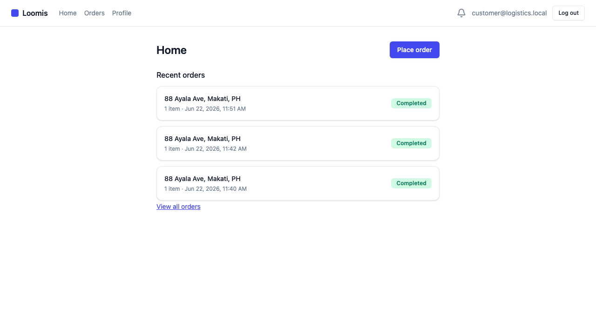
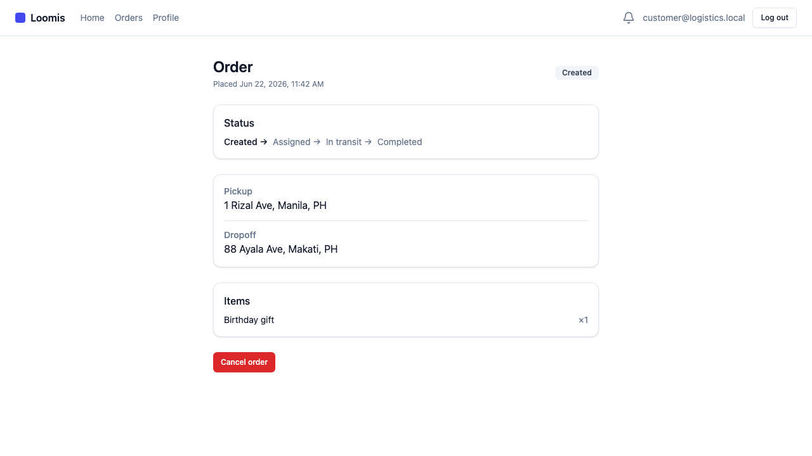
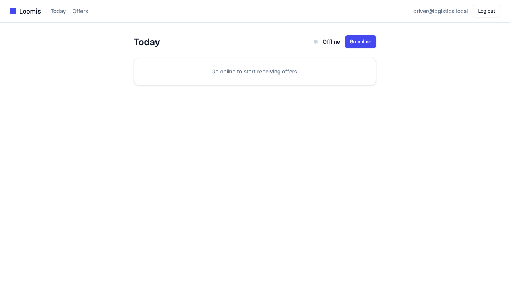
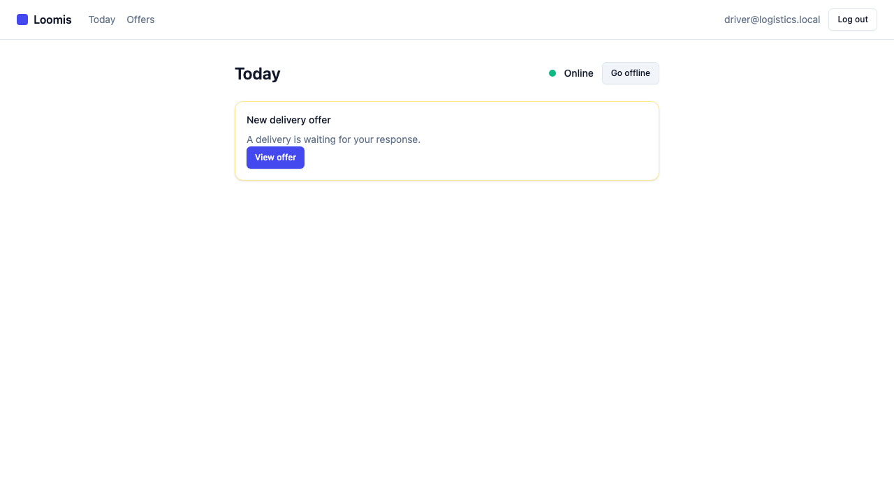
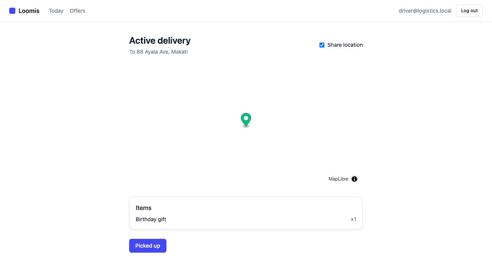
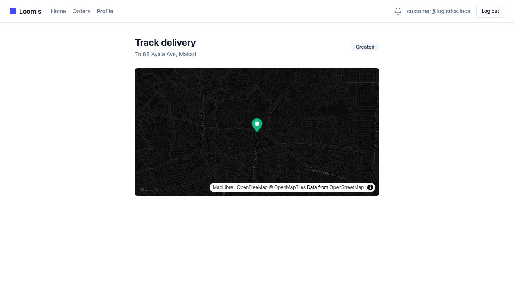
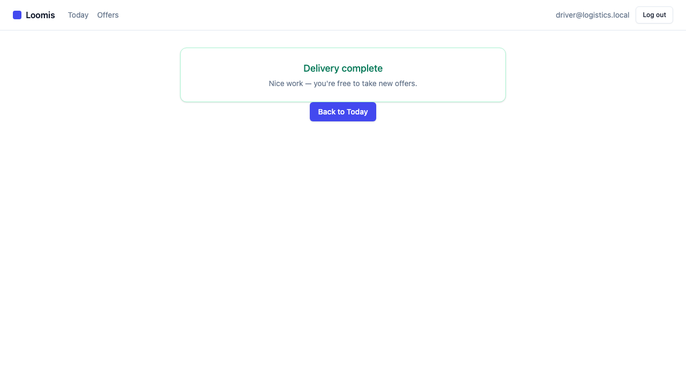
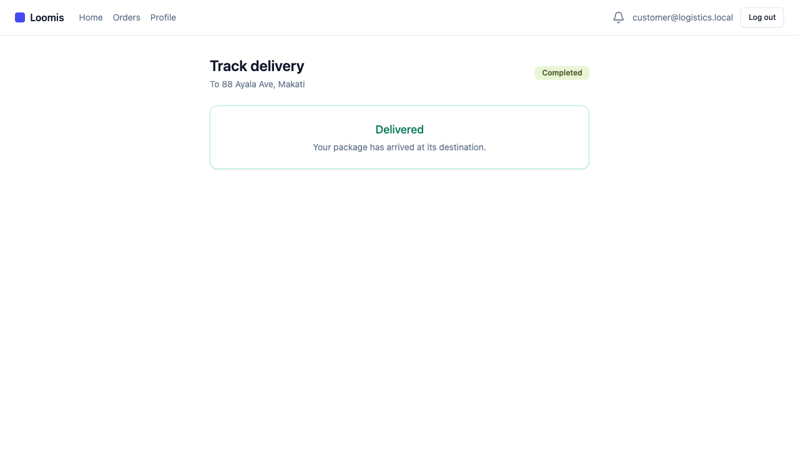

# Demo Walkthrough — The Delivery Lifecycle

This walks the full two-sided delivery lifecycle of the AI Logistics platform,
driven end-to-end through the browser against the local stack: a **customer**
places an order, a **driver** goes online and accepts it, the customer watches
the driver move on a **live map**, and the order completes — with the status
rippling back through the event bus.

Each step below is a real screen captured during the automated demo run. Read it
top to bottom to narrate your own video, or watch the recordings:
[customer journey](lifecycle-customer.webm) · [driver journey](lifecycle-driver.webm).

> **Setup:** the whole backend (7 services + RabbitMQ + Redis + 4 Postgres + 2
> Mongo) runs locally via the [RUNBOOK](../../../local-stack/RUNBOOK.md); the web
> app runs with `npm run dev`. Two seeded accounts are used: `customer@logistics.local`
> and a profile-complete `driver@logistics.local`.

---

## Customer side — placing the order

### 1. The customer's home


The customer signs in and lands on their home. The shell is role-aware — a
customer sees Home / Orders / Profile and a notifications bell. The primary call
to action is **Place order**.

### 2. Placing an order


The order form captures a pickup location, a saved dropoff address (with inline
add-address), and free-text line items. Behind the scenes this is a validated
form (react-hook-form + Zod) posting through the gateway to the **order-service**.

### 3. Order created


On submit the order is created and the customer lands on its detail page with a
status timeline. The order is now `created` and waiting for a driver — the
order-service has published an `order.created` event onto the bus, which
**dispatch-service** has consumed and parked until a driver is available.

---

## Driver side — accepting and delivering

### 4. The driver's day


The driver signs in to their **Today** screen. Their profile is complete, but
they're offline — no offers arrive until they go online.

### 5. An offer arrives


The moment the driver goes online, the user-service publishes
`driver.availability.changed`; dispatch re-attempts the parked order and offers
it to this driver. The Today screen polls `GET /v1/dispatch/offers/current` and
surfaces a **New delivery offer**.

### 6. Reviewing the offer


The offer shows the pickup, dropoff, and items, with **Accept** / **Reject** and
a TTL countdown — if the driver doesn't act in time the offer expires and
dispatch re-offers it.

### 7. The active delivery


On accept, the order becomes `assigned` (dispatch publishes
`dispatch.driver.assigned`) and the driver opens the active-delivery screen. The
driver's device now streams its geolocation over the tracking WebSocket. Tapping
**Picked up** moves the order to `in_transit`.

---

## Back to the customer — watching it live

### 8. Live tracking opens


From Home, the customer taps **Track**. The tracking screen connects to the
**tracking-service** over a Socket.IO WebSocket and renders a live MapLibre map
with the dropoff marker and a naive straight-line ETA.

### 9. The driver moves on the map


As the driver streams location updates, the customer sees the driver marker move
and a breadcrumb trail form in real time — the high-frequency location stream
flows driver → tracking-service → customer over WebSockets, not the event bus.

### 10. Delivered (driver)


The driver taps **Delivered**. The tracking-service publishes
`delivery.completed`; order-service reflects the order to `completed` and
dispatch frees the driver to take new offers.

### 11. Delivered (customer)


The customer's tracking screen — still connected over the WebSocket — flips to
**Delivered** without a refresh. The loop is closed: order → dispatch → tracking
→ completion, all visible through the UI.

---

## How this was recorded

This walkthrough is generated by an automated Playwright run (NOT part of CI)
that drives the live local stack with two browser contexts (customer + driver,
the driver granted geolocation to stream position):

```bash
# bring the stack up first (see local-stack/RUNBOOK.md), then:
cd logistics-web
npm run demo:e2e
```

The run writes the screenshots to `docs/demo/screenshots/` and the videos to
`docs/demo/`.
