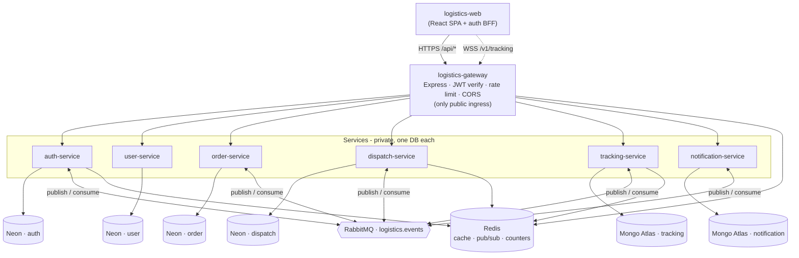

# System Architecture

The browser is the only client. All HTTP traffic enters through the gateway (the
single public ingress); the tracking WebSocket is the one other public path.
Each service owns its own database and **never** touches another service's data —
cross-service effects flow through RabbitMQ.

