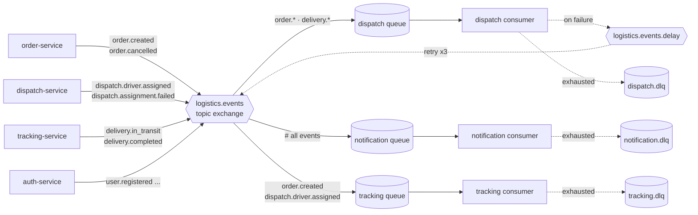

# Event-Bus Topology

A single topic exchange (`logistics.events`) fans events to per-service durable
queues. Each consumer is idempotent and has its own dead-letter queue; failures
retry via a delay exchange before landing in the DLQ. The notification service
binds `#` (every event).

