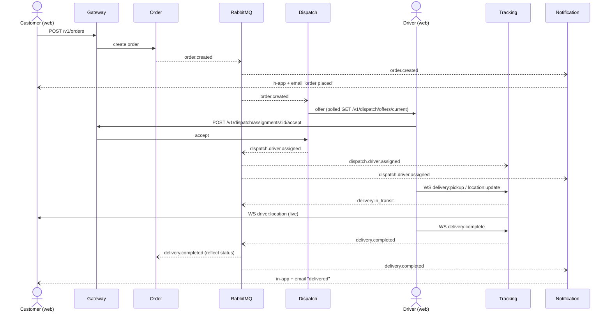

# Delivery Lifecycle

The closed loop: a customer places an order, dispatch offers it to an available
driver, the driver runs the delivery streaming location over the tracking
WebSocket, and completion ripples back through events to update the order and
notify the customer. Solid arrows are synchronous HTTP/WS; dashed arrows are
asynchronous RabbitMQ events.

