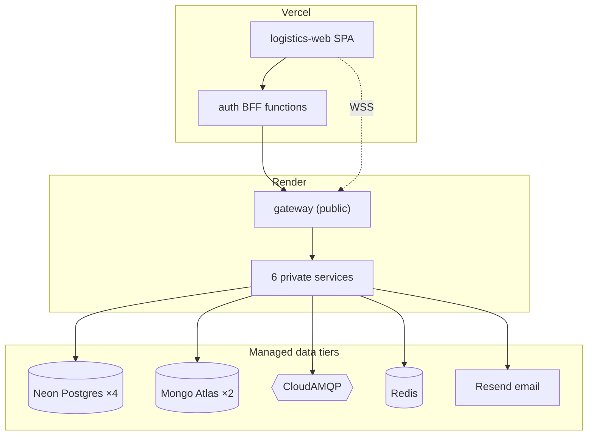

# Deployment Topology (target)

> **Target topology — not yet provisioned.** Phase 8 ships the config + runbook
> ([`logistics-infrastructure/DEPLOY.md`](../../../logistics-infrastructure/DEPLOY.md));
> the live deploy is a follow-up.

